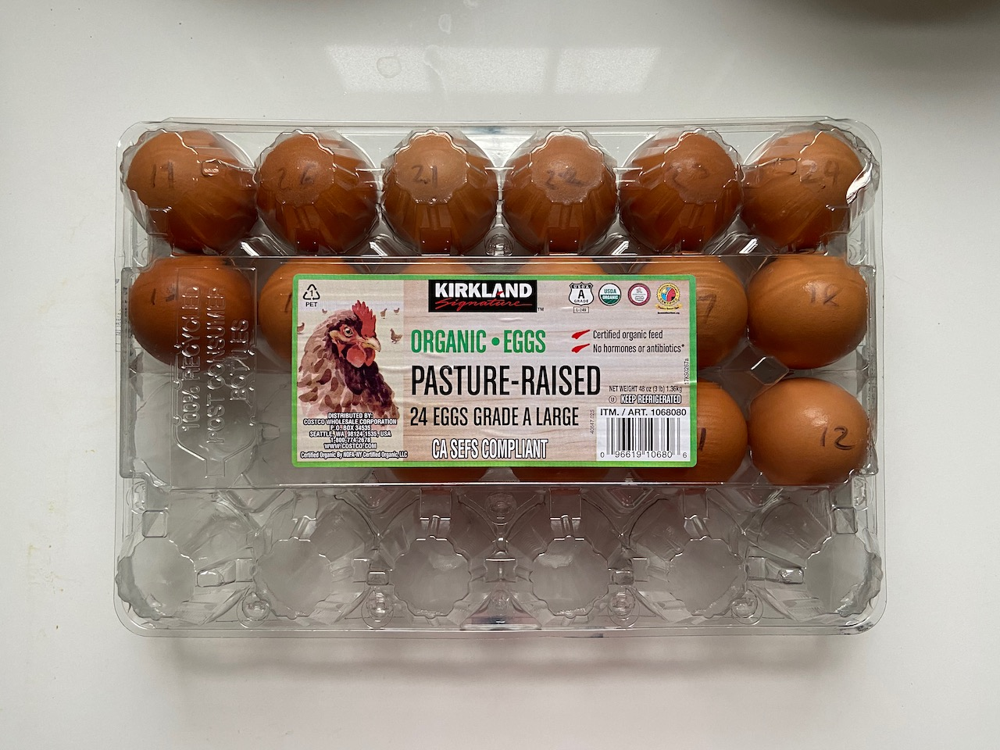
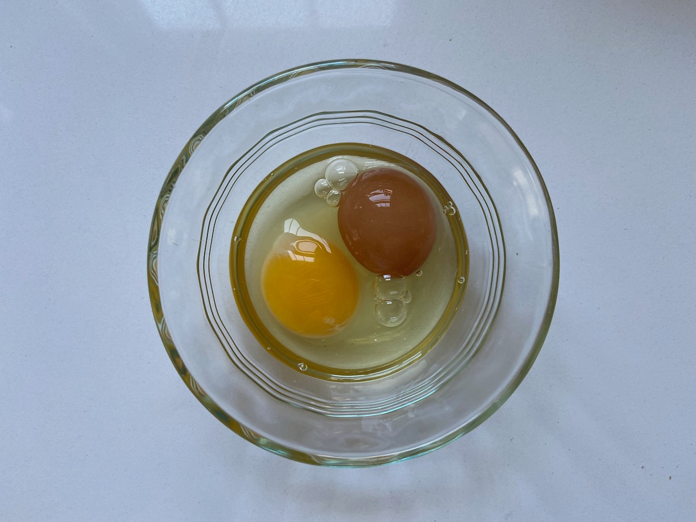
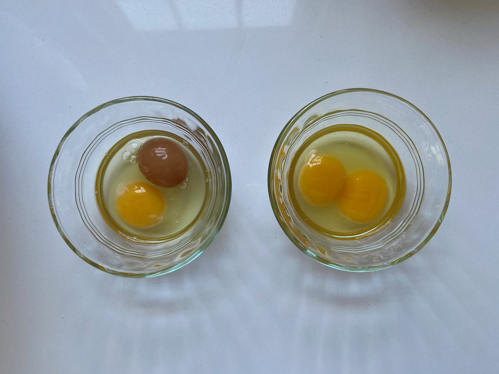

# Backstory

On September 8, 2020, I cracked open the first egg from this box of 24 Grade A Large Organic eggs from Costco.

THE EGG HAD ANOTHER EGG INSIDE!? It turns out this is a rare but [well-documented](https://www.buzzfeed.com/rachelysanders/tiny-eggs-can-exist-inside-other-eggs) phenomena.

Couldn't use that egg and cracked open a second egg. This one had a double yolk! While not as rare, it is still fairly atypical.

The third egg was typical. At this point we figured the fun was over, but the next five eggs proved us wrong:

* Egg #4 had a double yolk
* Egg #5 had a double yolk
* Egg #6 was typical
* Egg #7 had a double yolk
* Egg #8 had a double yolk

In summary, that's 1 egg in an egg, 5 double yolks, and 2 typical eggs. What awaits us in the 16 remaining eggs? That's how Egg Pool 2020 was born.